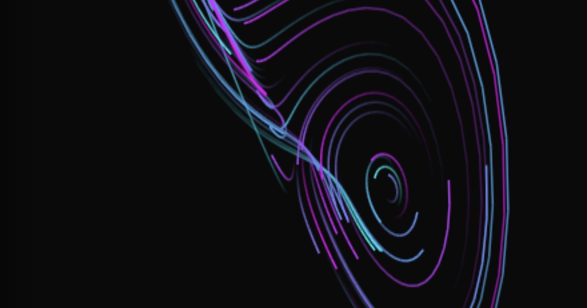

# Attractive

[](https://dr.eamer.dev/datavis/attractive/)
[](LICENSE)

Interactive 3D visualization playground for exploring chaotic strange attractors. Mix and match 26 mathematical systems with real-world data sources, choose from 30+ color palettes and 7 artistic rendering styles, then watch chaos unfold in real time.



**[Launch the playground →](https://dr.eamer.dev/datavis/attractive/)**

## What's Inside

This is a sandbox for chaos theory. Pick an attractor (Lorenz butterfly, Rössler spiral, Chua circuit, etc.), feed it data (climate, seismic, crypto, brain waves, audio input), and see how small changes in initial conditions create wildly different patterns.

### 26 Attractor Systems

- **Classic**: Lorenz (butterfly), Rössler (spiral band), Chua (double scroll)
- **Lorenz Family**: Chen, Lü (bridge), Burke-Shaw
- **Multi-Scroll**: Four-Wing, Dadras (tri-scroll), Dequan-Li, Rucklidge, Tsucs
- **Geometric**: Aizawa (torus knot), Thomas (cyclical), Halvorsen (tetrahedral), Newton-Leipnik
- **Physics-Derived**: Nosé-Hoover (molecular), Shimizu-Morioka (laser), Rabinovich-Fabrikant (plasma)
- **Simple Systems**: Sprott (minimal), Genesio-Tesi, Arneodo, Bouali
- **Iterative Maps**: Clifford (fractal), De Jong, Pickover (gnarled)

### 17 Data Sources

Real-world data modulates the chaos parameters of each system:

- **Environmental**: Climate (1960-2024), Weather, Ocean Currents, Tides, Solar Activity
- **Financial**: Economic Indicators, Stock Market, Cryptocurrency
- **Physical**: Seismic Activity, ISS Orbital Position, Traffic Flow, Power Grid
- **Biological**: Heart Rate/ECG, Brain Waves/EEG, Pandemic Dynamics
- **Digital**: Wikipedia Trends, Live Audio Input (uses your microphone)

### 30+ Color Schemes

Organized into 7 categories:
- **Vibrant**: Bioluminescent, Neon, Electric, Cyberpunk, Acid
- **Warm**: Fire, Sunset, Lava, Ember, Blood Moon, Solar, Oxidation
- **Cool**: Ocean, Ice, Aurora, Forest, Arctic, Twilight
- **Cosmic**: Cosmic, Nebula, Void, Supernova
- **Neutral**: Monochrome, Pastel, Sepia
- **Dark**: Matrix, Midnight, Obsidian
- **Scientific**: Viridis, Plasma, Infrared, Stellar

### 7 Visual Styles

Different rendering techniques for different aesthetics:

- **Clean** — Crisp lines with subtle glow (default)
- **Da Vinci** — Ink on aged parchment, hand-drawn lines
- **Blueprint** — Cyanotype (white-on-blue) technical drawing with grid
- **Neon** — Glowing tubes with strong blur
- **Chalk** — Rough strokes on blackboard texture
- **Oscilloscope** — Green phosphor on CRT with scanlines
- **Watercolor** — Pastel washes with bleeding pigments

### 21 Mathematical Presets

Famous bifurcation points and special parameter combinations:
- Lorenz Classic (σ=10, ρ=28)
- Lorenz Periodic (ρ=24.74)
- Rössler Funnel vs. Screw
- Chua Double Scroll vs. Spiral
- Four-Wing Symmetric
- Thomas Slow (b=0.18)
- and 15 more...

## Controls

### Mouse & Touch
- **Drag** to rotate the 3D view
- **Shift+Drag** or **Right-click drag** to pan
- **Scroll** to zoom
- **Touch**: 1-finger rotate, 2-finger pan/pinch zoom

### Keyboard
- **Space** — Play/pause animation
- **R** — Random combination
- **Ctrl+Z** / **Cmd+Z** — Undo last change
- **F** — Fullscreen
- **Arrow keys** — Rotate view
- **Escape** — Close modal

### Floating Toolbar
Bottom-left buttons control speed, give you a random combo, export to PNG, and show help.

## Features

- **40+ Curated Combos** — The Random button cycles through hand-picked combinations that look great
- **Undo System** — Ctrl+Z to step back through your changes
- **Auto-Rotate** — Slow camera rotation for screen savers
- **Auto-Animate** — Parameter sweeping to explore bifurcation diagrams
- **PNG Export** — Save screenshots of your favorite patterns
- **First-Visit Tour** — Guided walkthrough on your first visit
- **Fully Responsive** — Works on mobile, tablet, and desktop
- **Accessibility** — WCAG 2.1 AA compliant with keyboard navigation and screen reader support

## Tech Stack

Vanilla JavaScript with zero dependencies (except Rough.js for hand-drawn styles). No framework, no build step. Just HTML5 Canvas and math.

- **Rendering**: HTML5 Canvas 2D API
- **Math**: Euler integration of differential equations at 60fps
- **3D Projection**: Manual rotation matrix + orthographic projection
- **Artistic Effects**: [Rough.js](https://roughjs.com/) for hand-drawn line styles
- **Accessibility**: Semantic HTML5, ARIA landmarks, screen reader announcements

The entire simulation runs in `main.js` (~2500 lines). Canvas rendering handles particle trails with depth sorting, fade effects, and style-specific transformations.

## Local Development

No build step required. Serve the directory with any HTTP server:

```bash
python3 -m http.server 8000
# Open http://localhost:8000/
```

Or just open `index.html` directly in a modern browser.

## How It Works

Each attractor is a system of three differential equations describing how a point moves through 3D space. The equations are integrated using Euler's method at 60fps.

Real-world data from the selected source modulates the chaos parameters (σ, ρ, β for Lorenz; a, b, c for Rössler; etc.). Each dataset-attractor combination has curated defaults that produce clear, beautiful visualizations.

The rendering loop:
1. Compute new particle positions using attractor equations
2. Apply 3D rotation based on mouse/touch input
3. Project 3D coordinates to 2D screen space
4. Draw particle trails with style-specific effects (glow, hand-drawn lines, color transforms)
5. Apply depth-based brightness and trail fade if enabled

## Project Structure

```
attractive/
├── index.html       # Layout, controls, modal (490 lines)
├── main.js          # All logic: attractors, datasets, rendering (2530 lines)
├── style.css        # Dark theme, responsive layout (1850 lines)
├── onboarding.js    # First-visit guided tour (165 lines)
├── social-card.png  # Open Graph preview image
└── README.md        # This file
```

No modules, no bundler. Everything runs as a single top-level script.

## Adding Your Own Attractor

Add an entry to the `attractors` object in `main.js`:

```javascript
myattractor: {
  name: 'My Attractor',
  description: 'What makes this system interesting.',
  params: [
    { name: 'α (Alpha)', min: 0, max: 10, step: 0.1, default: 5, tooltip: 'Controls X behavior' },
    { name: 'β (Beta)', min: 0, max: 20, step: 0.1, default: 10, tooltip: 'Controls Y behavior' },
    { name: 'γ (Gamma)', min: 0, max: 30, step: 0.1, default: 15, tooltip: 'Controls Z behavior' }
  ],
  compute: (x, y, z, params, dt) => {
    const dx = /* your equation */;
    const dy = /* your equation */;
    const dz = /* your equation */;
    return [x + dx * dt, y + dy * dt, z + dz * dt];
  },
  scale: 10,           // Zoom multiplier
  initPos: [0.1, 0, 0], // Starting position
  initSpread: 0.5      // Random spread
}
```

Then add a corresponding `<option>` in `index.html` under `#attractorSelect`.

## License

MIT License. See [LICENSE](LICENSE) for details.

## Credits

Created by [Luke Steuber](https://lukesteuber.com)

Part of the [data visualization portfolio](https://dr.eamer.dev/datavis/) at dr.eamer.dev.

## Links

- **Live Demo**: https://dr.eamer.dev/datavis/attractive/
- **Portfolio**: https://lukesteuber.com
- **More Visualizations**: https://dr.eamer.dev/datavis/
